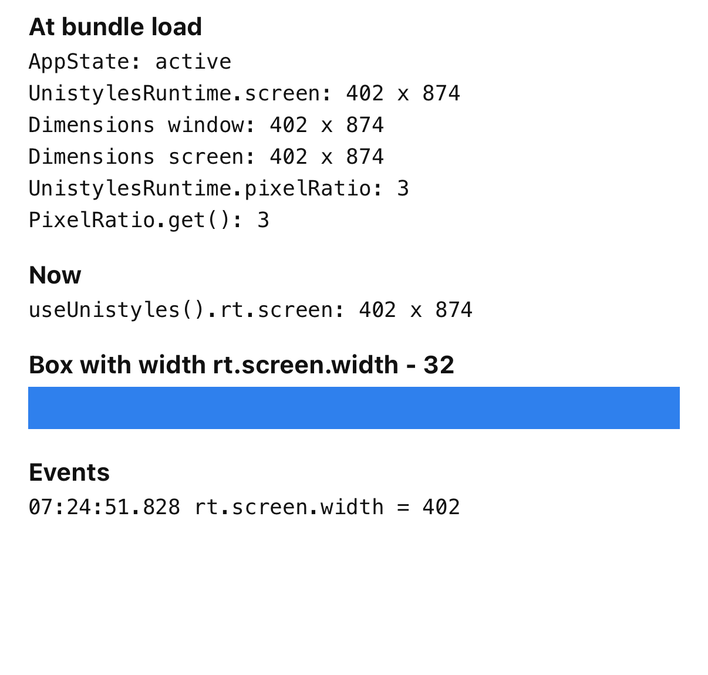
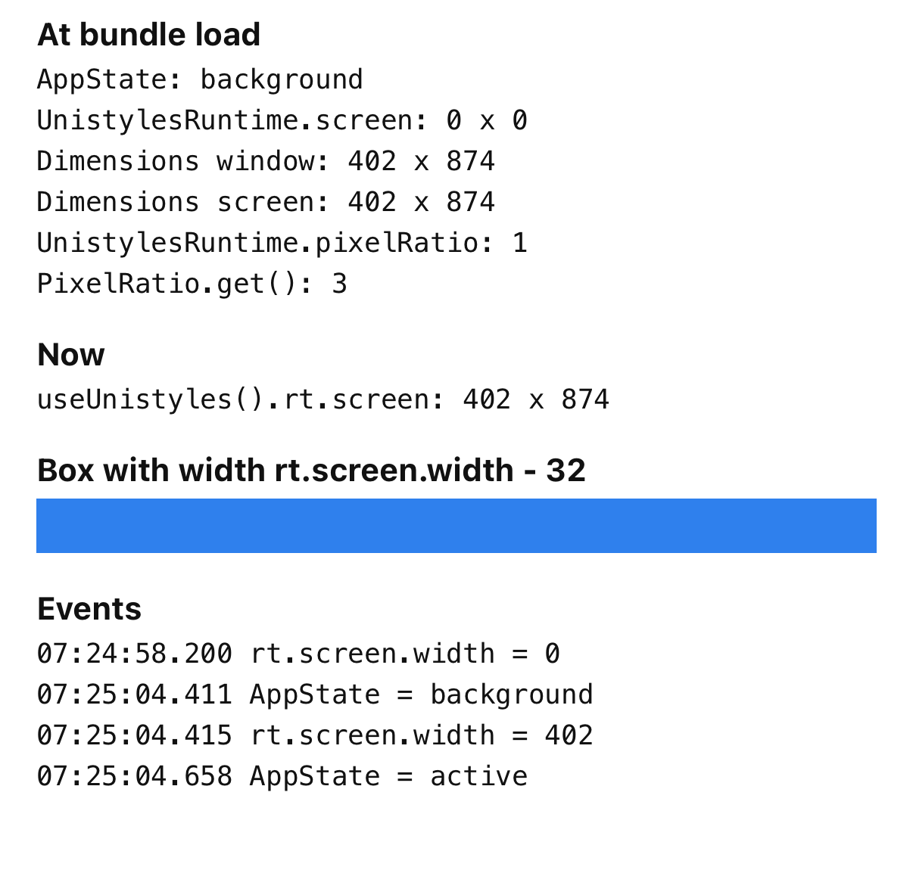

# Unistyles: screen is 0 x 0 after a background launch on iOS

Minimal repro for `UnistylesRuntime.screen` returning `{ width: 0, height: 0 }` when iOS launches the app in the background.

`src/launchSnapshot.ts` reads `UnistylesRuntime.screen`, `UnistylesRuntime.pixelRatio` and their React Native counterparts once, when the JS bundle loads. `src/App.tsx` shows that snapshot, the live `useUnistyles().rt.screen`, and a log of every `rt.screen.width` and `AppState` change.

Expo 57, React Native 0.86.3, react-native-unistyles 3.5.2, react-native-nitro-modules 0.37.1.

## Steps

```sh
bun install
npx expo prebuild -p ios
npx expo run:ios --configuration Release
```

With the app installed on a booted simulator:

```sh
xcrun simctl terminate booted com.example.unistylesbgrepro
xcrun simctl push booted com.example.unistylesbgrepro silent-push.apns
```

The push starts the app in the background. The simulator stays on the home screen. Wait a few seconds, then open the app.

The background modes in `app.json` include `fetch` because the simulator refuses the background launch with only `remote-notification` ("this app doesn't declare the proper UIBackgroundMode").

## Result

Normal launch (control):



Background launch, then opened:



At bundle load, `AppState` is `background`, `UnistylesRuntime.screen` is `0 x 0` and `UnistylesRuntime.pixelRatio` is `1`, while `Dimensions` is `402 x 874` and `PixelRatio.get()` is `3`. `rt.screen.width` changes to 402 when the app comes to the foreground.
